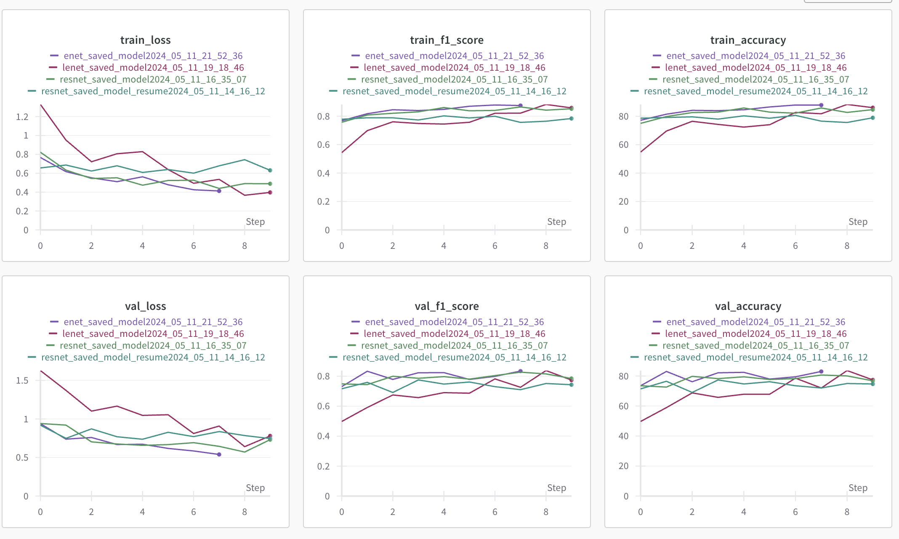

# Font Classification

> This repository contains code for classifying fonts using CNN techniques. Font classification involves identifying the font family or typeface of a given text image. This can be useful for various applications such as font recognition in images, document analysis, and typography-related projects. A few sample images


## Dataset
The dataset used for font classification consists of a collection of text images in corresponding folders indicating the font family or typeface. Each image in the dataset represents a sample of text written in a specific font.<br>
**There are total 10 font classes present in the dataset with approximate 80 sample images per font.**
The data is present at [project_files/data](https://github.com/mishra-kunal1/font_classification/tree/main/project_files/data) of the repo.
The folder structure looks like this 

<div align="left">
  
</div>


## Generating more data

The dataset also contains .ttf file for each font which can be used to generate synthetic images.<br>

> The process of generating synthetic data is explanied in [generating_synthetic_images.ipynb](https://github.com/mishra-kunal1/font_classification/blob/main/notebooks/generating_syntetic_images.ipynb)

After creating synthetic dataset we have a total of 10,000 training images 1000 validation images, an ample amount suitable for training CNN models effectively.

## Models 
The model's architecture can be found in **models** folder. The best performing models can be found in **saved_models** folder of the repo.
### 1. LeNet model 
The LeNet model is the first choice for image classification tasks due to its simplicity and effectiveness. We can convert the images to Grayscale and then pass it through Conv2d  and max pool layers. Since it is small model (200k params) , it is trianed from scratch on the given dataset. 

### 2. ResNet18 model
The second model that was chosen was ResNet18 model. Transfer learning method was used to fine tune the model by freezing all the weights. The last layer of the model was modified to have number of output neurons as 10. Two versions of Resnet model (with different hyperparams and augmentation techniques) were trained and evaulated. 

### 3. Efficientnet model
In order to experiment with some modern architectures , fine tuning on efficientnet-b1 is done. EfficientNet models are highly efficient due to their compound scaling method, achieving good performance with fewer parameters. Since we have limited compute fine tuning this model was a prudent choice.

## Performance Metrics

Since the number of sample images were balanced, we considered accuracy as our first metric. In order to make the model more generalised and keep track of false positives and false negatives we also logged precision, recall and f1 score. During training the checkpoints were comparing the validation f1 score and the models with highest score were saved.

## Training, Logging 
- The training is done on single instance of Cloud GPUs. To monitor train metrics a subset of train data was put into eval mode along with the validation data
- Logging and experiment tracking was done using Weights and Biases. Here's a snapshot of performance of top 4 models



## Results
Here is a table summarizing the performance of the top 4 models:

| Model         | Accuracy | F1 Score |
|---------------|----------|-----------|
| LeNet         | 0.81     | 0.83      | 
| ResNet18      | 0.78     | 0.80      | 
| ResNet18-256  | 0.83     | 0.85      | 
| EfficientNet  | 0.80     | 0.79      | 


## Installation and Usage

### 1. Clone the GitHub repo:<br />
   ```
    git clone https://github.com/mishra-kunal1/font_classification.git
   ```
   
### 2. Change the dir and Install the requirements:<br />
   ```
   cd font_classification
   pip install -r requirements.txt
   ```

### 3. Prepare the dataset: <br />
   ```
   python prepare_dataset.py
   ```

### 4. Training the model: <br />
   #### 4.1 To start training the data from scratch using LeNet:<br />
   ```
   python train.py --model lenet
   ```

   #### 4.2 To Fine tune the model using ResNet18:<br />
   *Make sure to remove the grayscale transformation in the train.py file.*<br />
   ```
   python train.py --model resnet
   ```
   
   #### 4.3 To Fine tune the model using EfficientNet B1 :<br />
  *Make sure to remove the grayscale transformation in the train.py file.* <br />
  ```
   python train.py --model enet
   ```

   #### 4.4 To resume training from last checkpoint <br />
  ```
   python train.py --model resnet --resume yes
   ```

### 5. Evaluating the performance of test data <br />
  **Important  - Make sure to add the test_data path to inference.py before running the code.** <br />

  ```
    python inference.py
  ```
    


